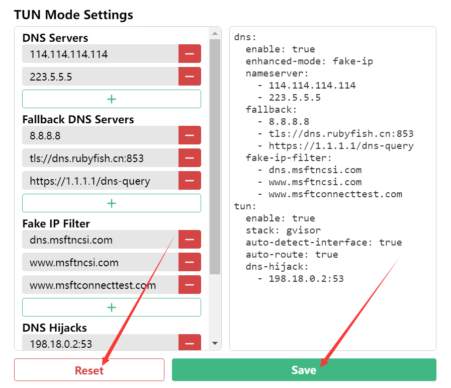

# CFW TUN 模式

## CFW TUN模式


对于不遵循系统代理的软件，开启 TUN 模式将在电脑设置一个虚拟网卡，接管其流量并交由 CFW 处理，在 Windows 中，TUN 模式性能比 TAP 模式好


### 安装TUN驱动

在**`General`**菜单中找到**`Service Mode`**选项，点击**`Manage` > `Install`**

安装成功后右侧**小地球应变为绿色**


### 设置并开启CFW TUN

点击**`TUN Mode` 旁边的齿轮 > `Reset` > `Save`**




图中的<mark style="color:purple;">**DNS设置**</mark>是作者改过的，要不要照着改随你


**DNS Servers**

```
223.5.5.5
119.29.29.29
```

**Fallback DNS Servers**

```
8.8.8.8
tls://dns.rubyfish.cn:853
https://1.1.1.1/dns-query
```

最后将**`TUN Mode`**选项右侧的开关打开即可

打开**`控制面板` > `网络和 Internet` > `网络和共享中心` > 左侧`更改适配器设置`**，找到名称为**`Clash`**且描述为**`Clash Tunnel`**的适配器，如果显示已启用，说明TUN模式成功开启


## 热点共享网络


[quest-net.md](../../quest-guide/quest-net.md)

