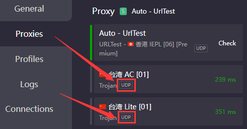

# ❗ 网络基础问题(必读)


## Q：为什么<mark style="color:red;">能上谷歌油管</mark>却不能连Oculus？

A：因为平时上网使用的是TCP协议

普通上网是使用的 http/https 等，是基于TCP协议进行网络数据传输

如系统代理，浏览器代理，WiFi代理等


## UDP数据包

而电子设备（如手机电脑）连接WiFi时需要对设备进行**时间校准**，这个校准步骤就同时验证这个WiFi是否可以连网，但这个校准是基于UDP协议的，你只开启梯子的**系统代理**<mark style="color:red;">**只能走TCP**</mark>又<mark style="color:red;">**不支持UDP**</mark>，当然只能上网不能**校准时间**咯

### UDP不可用的常见问题

* Quest2 WiFi显示**网络受限**
* 头显固件更新卡在0%
* 头显内应用商店无法访问
* 头显无法下载游戏
* 在线游戏无法联网


需要你的<mark style="color:red;">**梯子线路**</mark>、<mark style="color:red;">**客户端**</mark>以及<mark style="color:red;">**联网方式**</mark>三者<mark style="color:red;">**同时**</mark>**支持UDP转发**，才可以使用


### 如何知道线路是否支持UDP

打开clash代理页面，查看服务器是否有**`UDP`**标签

<figure><figcaption></figcaption></figure>

### 现有UDP支持方案

* Win10 无线网卡热点，配合梯子的TUN模式共享网络
* 激活路由器，使用第三方固件支持UDP转发
* 苹果电脑，[**ClashX Pro**](https://install.appcenter.ms/users/clashx/apps/clashx-pro/distribution\_groups/public)打开网关模式，头显WiFi设置静态IP与网关
* 安卓手机<mark style="color:red;">开启root权限</mark>，并使用[**V\*N Hotspot**](https://apkpure.com/vpn-hotspot/be.mygod.vpnhotspot)开启热点
  * 正常开启热点无法代理UDP数据

<mark style="color:red;">**局域网共享**</mark>无法代理UDP数据包，不可用于激活/更新/下载软件\
包括**`SS/V2局域网共享`**，**`Clash允许LAN连接`**，**`手机代理局域网共享`**等


凡是在WIFI中设置<mark style="color:red;">代理服务器</mark>以及<mark style="color:red;">端口</mark>的方式，通通不能转发UDP数据包


### 路由器

* 老毛子路由器，买好成品即可使用
* 华硕路由器，买来自己刷梅林固件并安装上网插件
* 软路由，安装软路由系统的设备即可
  * 可以购买一台实体设备并刷入系统
  * 可以用U盘装软路由系统，电脑通过U盘启动即可成为软路由
