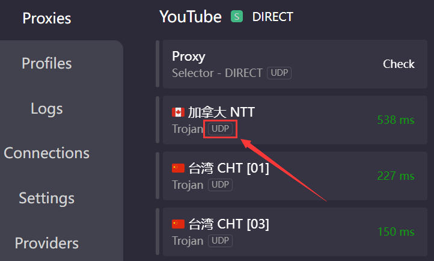

# 网络基础问题(必读)


Quest激活需要**UDP数据传输**，也就是说需要你的**梯子线路**，以及**客户端**支持**UDP转发**，才可以成功**激活**并**更新固件**


### 如何知道线路是否支持UDP

打开clash代理页面，查看服务器是否有**`UDP`**标签\

### 现有UDP支持方案

<mark style="color:red;">**只有以下3种**</mark>

* Win10 无线网卡热点，配合梯子的TUN模式共享网络
* 激活路由器，使用第三方固件支持UDP转发
* 苹果电脑，[**ClashX Pro**](https://install.appcenter.ms/users/clashx/apps/clashx-pro/distribution\_groups/public)打开网关模式，头显WiFi设置静态IP与网关

<mark style="color:red;">**局域网代理**</mark>无法代理UDP数据包，不可用于激活/更新/下载软件\
包括**`SS/V2局域网共享`**，**`Clash允许LAN连接`**，**`手机代理局域网共享`**等


凡是在WIFI中设置<mark style="color:red;">代理服务器以及端口</mark>的方式，通通不能转发UDP数据包


### 路由器

* 老毛子路由器，买好成品即可使用
* 华硕路由器，买来自己刷梅林固件并安装上网插件
* 软路由，安装软路由系统的设备即可
  * 可以购买一台实体设备并刷入系统
  * 可以用U盘装软路由系统，电脑通过U盘启动即可成为软路由
