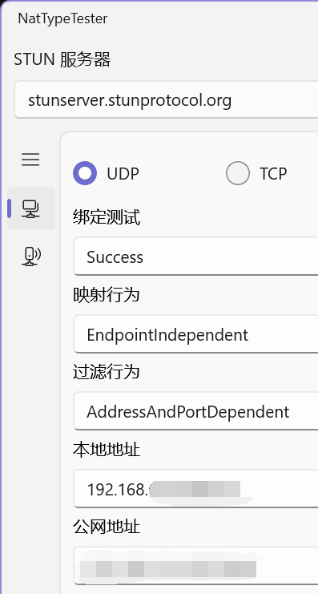

# ❗ 网络受限原因(必读)

## Q：为什么<mark style="color:red;">能上谷歌油管</mark>却网络受限？

A：因为平时上网使用的是TCP协议

1.  普通上网是使用的 http/https 等，是基于TCP协议进行网络数据传输

    如系统代理，浏览器代理，WiFi代理等
2. 而电子设备（如手机电脑）连接WiFi时需要对设备进行**时间校准**，这个校准步骤就同时验证这个WiFi是否可以连网，但这个校准是基于UDP的，只开启梯子的**系统代理**<mark style="color:red;">**只能走TCP**</mark>又<mark style="color:red;">**不支持UDP**</mark>，所以只能上网不能**校准时间**


需要你的<mark style="color:red;">**梯子线路**</mark>、<mark style="color:red;">**客户端**</mark>以及<mark style="color:red;">**联网方式**</mark>三者<mark style="color:red;">**同时**</mark>**支持UDP转发**，才可以使用


***

## 如何知道线路是否支持UDP

开启[Clash Tun模式](udp-hotspot/clash-tun.md)，使用[NatTypeTester](https://github.com/HMBSbige/NatTypeTester/releases)测试

如显示<mark style="color:green;">**Success**</mark>且<mark style="color:yellow;">**公网地址**</mark>为<mark style="color:yellow;">**国外IP**</mark>，那就正常使用

<figure><figcaption></figcaption></figure>

***

### 现有UDP支持方案

* Win10 无线网卡热点，配合梯子的TUN模式共享网络
* 激活路由器，使用第三方固件支持UDP转发
* 安卓手机<mark style="color:red;">开启root权限</mark>，并使用[**V\*N Hotspot**](https://apkpure.com/vpn-hotspot/be.mygod.vpnhotspot)开启热点
  * 正常开启热点无法代理UDP数据


凡是在WIFI中设置<mark style="color:red;">代理服务器</mark>以及<mark style="color:red;">端口</mark>的<mark style="color:red;">**局域网共享**</mark>方式，通通不能转发UDP数据包


### 路由器

* 老毛子路由器，买好成品即可使用
* 华硕路由器，买来自己刷梅林固件并安装上网插件
* 软路由，安装软路由系统的设备即可
  * 可以购买一台实体设备并刷入系统
  * 可以用U盘装软路由系统，电脑通过U盘启动即可成为软路由
