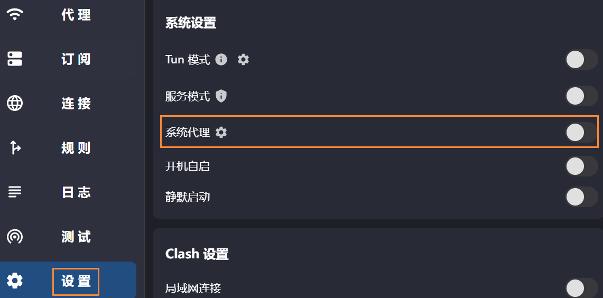

# 🐱 Clash Verge

## 简介

* [项目主页](https://github.com/clash-verge-rev/clash-verge-rev)

Clash Verge是一个Clash图形界面客户端


如果使用的机场支持Clash托管，您可以使用此客户端，如果不支持该格式托管仍想使用Clash，请自行寻找配置转换方式


## 下载使用

* [**Github releases**](https://github.com/clash-verge-rev/clash-verge-rev/releases)

下载对应版本之后安装运行，托盘区会出现一个深蓝色的猫咪图标，这时Clash就启动成功了

***

## 托管订阅

在机场首页寻找Clash托管订阅地址，将其复制，选择左侧<mark style="color:yellow;">**订阅**</mark>，在上部粘贴**托管地址**并点击<mark style="color:yellow;">**导入**</mark>，如果下部出现了新的配置选项，那么就订阅成功了


如果订阅失败，请尝试 <mark style="color:yellow;">**手动下载配置**</mark> 并 <mark style="color:yellow;">**新建**</mark> <mark style="color:yellow;">**类型**</mark> 为 <mark style="color:yellow;">**Local**</mark> 的配置，并选择下载的订阅文件


## 开启系统代理

进入<mark style="color:yellow;">**设置**</mark>页面，将<mark style="color:yellow;">**系统代理**</mark>选项打开，托盘区图标变为橙色即可正常使用

> 或者可以右键托盘区图标，勾选<mark style="color:yellow;">**系统代理**</mark>

<figure><figcaption></figcaption></figure>

### 选择线路

进入左侧<mark style="color:yellow;">**代理**</mark>页面，根据配置自行选择需要的线路


由于各个机场使用的配置文件不一样，分流规则也不一样，详细的分流策略设置请咨询各家机场，或自行查询


## TUN模式


[clash-tun.md](clash-tun.md)



对于不遵循系统代理的软件，开启 TUN 模式将在电脑设置一个虚拟网卡，接管其流量并交由 Clash 处理

