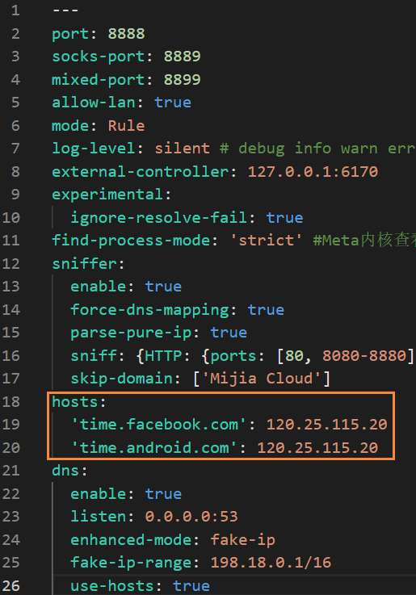

# 🕰️ NTP解析激活(无需UDP)

## 原理

将Facebook时间服务器地址**`time.facebook.com`**解析至国内时间服务器，以获取正确的时间回应，从而解决网络受限的问题


**注意**：此方法不可用于游戏联网(如VRChat)，如需游戏联网，请参照[虚拟网卡+热点篇](udp-hotspot/)


#### 阿里云时间服务器地址

```
203.107.6.88 ntp.aliyun.com
120.25.115.20 ntp1.aliyun.com
```

## 两种修改解析的方案



使用Clash内置DNS解析功能，通过修改配置对NTP域名进行解析


路由器与手机端的Clash也可使用此方法


在Clash Verge的 <mark style="color:yellow;">**订阅**</mark> 设置中，右键 <mark style="color:yellow;">**订阅配置**</mark>，<mark style="color:yellow;">**编辑文件**</mark>，将下面的代码粘贴进配置文件并保存

```yaml
hosts:
    'time.facebook.com': 120.25.115.20
```

<div align="left">

<figure><figcaption></figcaption></figure>

</div>

示例：

<div align="left">

<figure><figcaption></figcaption></figure>

</div>

然后点击右上角的<mark style="color:yellow;">**火焰图标**</mark>(重新激活订阅)


如果不生效，尝试将<mark style="color:yellow;">`dns`</mark>中<mark style="color:yellow;">`enhanced-mode`</mark>的<mark style="color:red;">`fake-ip`</mark>改为<mark style="color:red;">`redir-host`</mark> 或在dns块中，添加如示例图中的倒数第二行<mark style="color:yellow;">`use-hosts: true`</mark>




### 一般市售路由器


各品牌路由器设置不一样，需要自行查找修改方法


<mark style="color:red;">首先打开路由器的ssh功能</mark>

然后按下电脑上的**`Win+R`**键，输入**`cmd`**打开命令提示符

输入以下命令，回车并输入密码，连接至路由器

```
ssh 路由器用户名@路由器IP
```

然后输入以下命令，添加Facebook的时间服务器解析

```
sed -i '$a 120.25.115.20 time.facebook.com' /etc/hosts
```

查看是否修改成功

```
cat /etc/hosts
```

### 软路由

网络设置>DHCP/DNS设置底部>自定义劫持域名>填写<mark style="color:blue;">Facebook NTP域名</mark>与<mark style="color:blue;">阿里云NTP的IP</mark>



**视频需要使用梯子(发布在**[**YouTube**](https://youtu.be/5ckX453ODfE)**)**





## 设置Quest代理

将Facebook的NTP服务器地址修改解析完成后，把<mark style="color:yellow;">Clash Verge 设置</mark>中的<mark style="color:yellow;">**局域网连接**</mark>打开

<figure><figcaption></figcaption></figure>

将Quest头显连接至与<mark style="color:yellow;">电脑相同的WiFi路由器</mark>

然后在Quest中，编辑当前连接的WiFi设置

将<mark style="color:yellow;">**代理**</mark>改为<mark style="color:yellow;">**手动**</mark>，把<mark style="color:yellow;">**电脑的IP**</mark>和<mark style="color:yellow;">**端口**</mark>输入进去即可

<div align="left">

<figure><figcaption></figcaption></figure>

</div>

### 如何查看设备IP



打开系统设置>网络和Internet>网线或WiFi的属性

<div align="left">

<figure><figcaption></figcaption></figure>

</div>

拉至最下，找到 <mark style="color:yellow;">**IPv4地址**</mark>

<div align="left">

<figure><figcaption></figcaption></figure>

</div>



系统托盘查看WiFi属性，或者是有线的属性

<div align="left">


</div>

拉至最下，找到 <mark style="color:yellow;">**IPv4地址**</mark>

<div align="left">


</div>



以MIUI示例

打开WiFi设置，点击<mark style="color:yellow;">**右箭头**</mark>查看<mark style="color:yellow;">**更多详情**</mark>

<div align="left">

<figure><figcaption></figcaption></figure>

</div>

在IP地址中寻找<mark style="color:yellow;">**IPv4地址**</mark>

可能会出现很多IPv6地址<mark style="color:yellow;">**一直在滚动**</mark>，等看到了<mark style="color:yellow;">**纯数字格式的IP**</mark>就截图保存

<div align="left">

<figure><figcaption></figcaption></figure>

</div>



***

#### Oculus请求的DNS地址

_仅是抓包参考地址，并非全都要改_&#x20;

```
connectivitycheck.gstatic.com
time.facebook.com
www.google.com
oculus.com
graph.oculus.com
mqtt-mini.facebook.com
in.appcenter.ms
graph.facebook-hardware.com
graph.facebook.com
```
