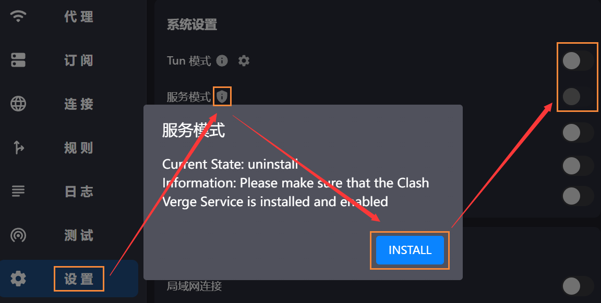
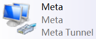
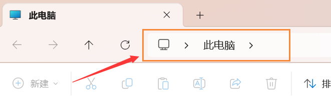

# 🖥️ Quest激活-电脑热点

此方案需使用电脑的**无线网卡**，如台式机没有无线网卡，**就去买一个USB WIFI**，如果**不支持开启系统原生热点**，可以使用网上搜索的免费热点软件进行共享


需要<mark style="color:red;">**支持UDP转发**</mark>，否则网络受限 [#udp-ce-shi](basic-net.md#udp-ce-shi "mention")

[proxy-server.md](../ready/proxy-server.md "mention")


***

## Clash TUN模式

对于不遵循系统代理的软件，开启 TUN 模式将在电脑设置一个虚拟网卡，接管其流量并交由 Clash 处理


日常上网**系统代理**足够，不需要开启Tun模式，否则容易与游戏加速器等冲突


### 安装服务模式

在 [Clash Verge](clash/) <mark style="color:yellow;">**设置**</mark> 菜单中找到 <mark style="color:yellow;">**服务模式**</mark> ，点击 <mark style="color:yellow;">**盾牌图标**</mark>** > **<mark style="color:yellow;">**Install**</mark>

安装成功后会显示 `Current State: installed`

### 开启TUN

在 <mark style="color:yellow;">**设置**</mark> 中将 <mark style="color:yellow;">**服务模式**</mark> 和 <mark style="color:yellow;">**Tun模式**</mark> 选项右侧的开关打开即可

<div align="left">

<figure><figcaption></figcaption></figure>

</div>

### 检查虚拟网卡适配器

打开**`控制面板` > `网络和 Internet` > `网络和共享中心` > 左侧`更改适配器设置`**，找到名称为**`Meta`**且描述为**`Meta Tunnel`**的适配器，如果显示已启用，说明TUN模式成功开启

<div align="left">

<figure><figcaption></figcaption></figure>

</div>

> 如果你不知道怎么打开控制面板，那就随便打开一个文件夹，把下面这行目录粘贴到文件夹地址栏，然后回车
>
> ```
> 控制面板\网络和 Internet\网络和共享中心
> ```

<div align="left">

<figure><figcaption></figcaption></figure>

</div>


如果clash设置完后没有出现TUN适配器、或开启网络共享之后、适配器消失等情况，尝试重启电脑


***

## 热点共享 <a href="#re-dian-gong-xiang" id="re-dian-gong-xiang"></a>

首先启用[Clash的虚拟网卡](clash/clash-tun.md)

然后开启你的WIFI热点，然后会在你的网络适配器中多出一个**`本地连接* <数字>`**且描述为**`Microsoft Wi-Fi ...`**的适配器，这是你的**`WIFI热点网络适配器`**

<div align="left">


</div>

右键<mark style="color:yellow;">**Clash**</mark>的**`Meta虚拟网卡`** **>** **`属性`** **>** **`共享`**，勾选**`允许其他网络用户...`**，在下拉菜单中选择之前开启的名称为 **`本地连接* <数字>`** 的**`WIFI热点适配器`**，如果没有下拉菜单，先取消**`允许共享`**，保存关闭之后再回来打开​

<div align="left">


</div>

设置完成，将你的头显连接至你的电脑WIFI热点，即可正常连接网络

> **USB热点**
>
> 如果你用的USB WiFi已经自带了IP，共享时提示改为自动获取，那就打开热点适配器的**属性 > Internet协议版本4 > 改为自动获取**，再进行共享
