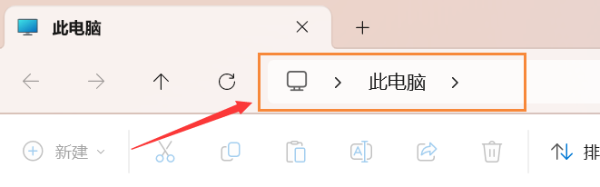

# Clash TUN 模式

## Clash TUN模式

对于不遵循系统代理的软件，开启 TUN 模式将在电脑设置一个虚拟网卡，接管其流量并交由 Clash 处理


日常上网**系统代理**足够，不需要开启Tun模式，否则容易与游戏加速器等冲突


### 安装服务模式

在 <mark style="color:yellow;">**设置**</mark> 菜单中找到 <mark style="color:yellow;">**服务模式**</mark> 选项，点击 <mark style="color:yellow;">**盾牌图标**</mark>** > **<mark style="color:yellow;">**Install**</mark>

安装成功后会显示 `Current State: installed`

### 开启TUN

在 <mark style="color:yellow;">**设置**</mark> 中将 <mark style="color:yellow;">**服务模式**</mark> 和 <mark style="color:yellow;">**Tun模式**</mark> 选项右侧的开关打开即可

<div align="left">

<figure><figcaption></figcaption></figure>

</div>

### 检查虚拟网卡适配器

打开**`控制面板` > `网络和 Internet` > `网络和共享中心` > 左侧`更改适配器设置`**，找到名称为**`Meta`**且描述为**`Meta Tunnel`**的适配器，如果显示已启用，说明TUN模式成功开启

<div align="left">

<figure><figcaption></figcaption></figure>

</div>

> 如果你不知道怎么打开控制面板，那就随便打开一个文件夹，把下面这行目录粘贴到文件夹地址栏，然后回车
>
> ```
> 控制面板\网络和 Internet\网络连接
> ```

<div align="left">

<figure><figcaption></figcaption></figure>

</div>


如果clash设置完后没有出现TUN适配器、或开启网络共享之后、适配器消失等情况，尝试重启电脑

