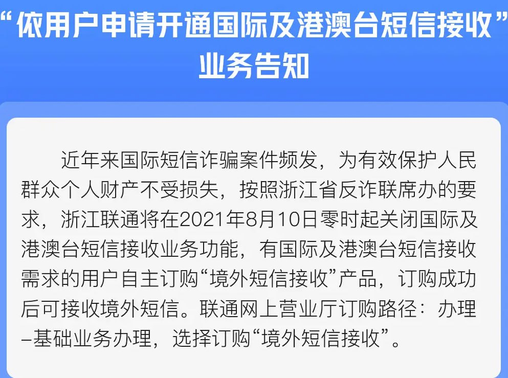
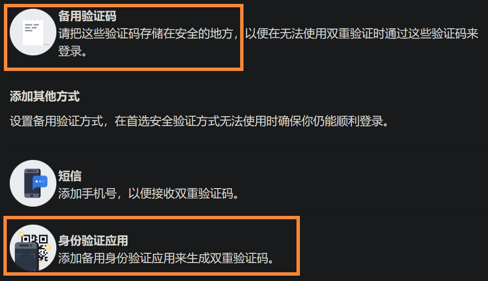

# 📩 收不到手机验证码

## 运营默认关闭了境外短信接收，需要用户手动开通

<figure><figcaption></figcaption></figure>

如果还是收不到的话只能去申诉了

* [**Meta支持中心**](https://www.meta.com/zh-cn/help/support/)

账户>使用Quest设备>Meta账户帮助>\
我需要帮助来设置我的 Meta 帐户>\
拉到下面>这并未能解决我的问题>

然后填写信息

## 登录之后

记得第一时间开启两步验证，并且把<mark style="color:red;">**备用验证码保存好**</mark>，以防万一

<figure><figcaption></figcaption></figure>

